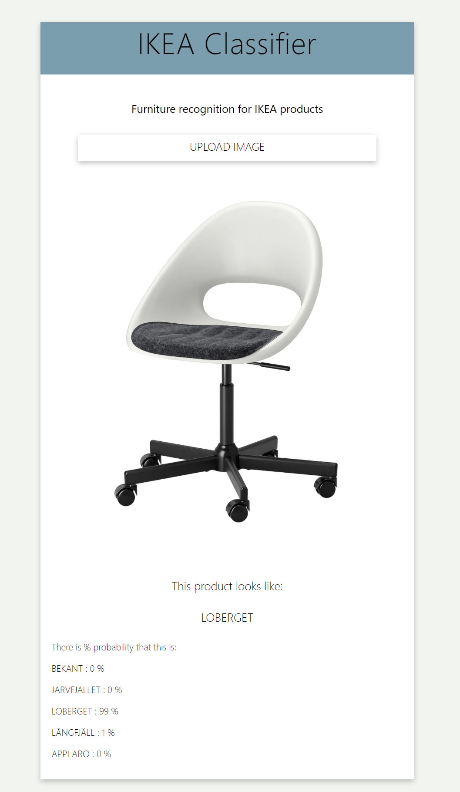

 

 
  <h3 align="center">IKEA_classifier_frontend
</h3>

  

    Web application to identify ikea store furniture in pictures
  

<!-- ABOUT THE PROJECT -->
### About The Project

The application [IKEA_Classifier](https://ikea-classifier.herokuapp.com/) is based on React library and integrated model of neural networks based on FastAi library.
You can find out more about the whole project here: [IKEA_Products_Recognition_AI](https://github.com/Greqorian/IKEA_Products_Recognition_AI)

The current version 2.0 of the application recognizes up to 100 different pieces of furniture. Ultimately, the application should recognize the full range of IKEA furniture, i.e. over 1700 items.

### How to use

Navigate to your application on Heroku: [IKEA_Classifier](https://ikea-classifier.herokuapp.com/)

Or clone the repository use the `npm install` command and `npm start` to launch the applications locally.

### UX Design 

| Wireframes                                       | Desktop preview                           | 
|--------------------------------------------------|-------------------------------------------|
|  ||

### Built With

* [Reract](https://reactjs.org/)
* [JavaScript](https://www.javascript.com/)
* [Sass](https://sass-lang.com/)

<!-- CONTACT -->
### Contact

Gregor Pawlak - [linkedIn](https://www.linkedin.com/in/grzegorz-pawlak/) 

Project Link: [https://github.com/Greqorian/IKEA_classifier_frontend](https://github.com/Greqorian/IKEA_classifier_frontend)
